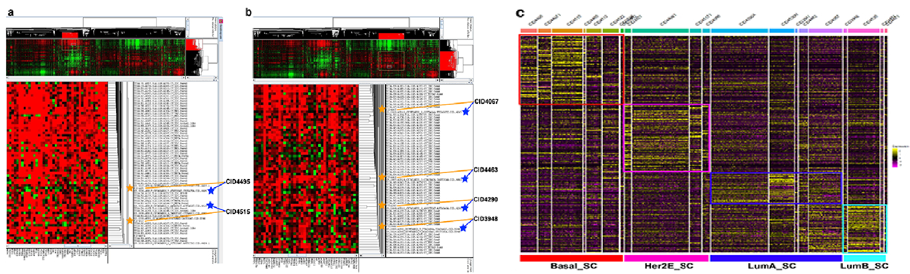
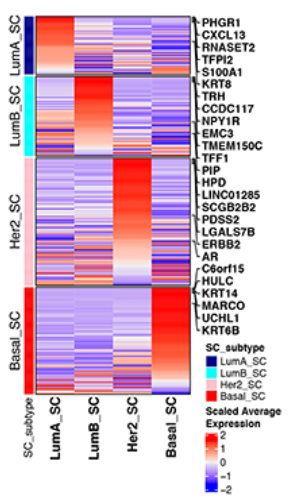
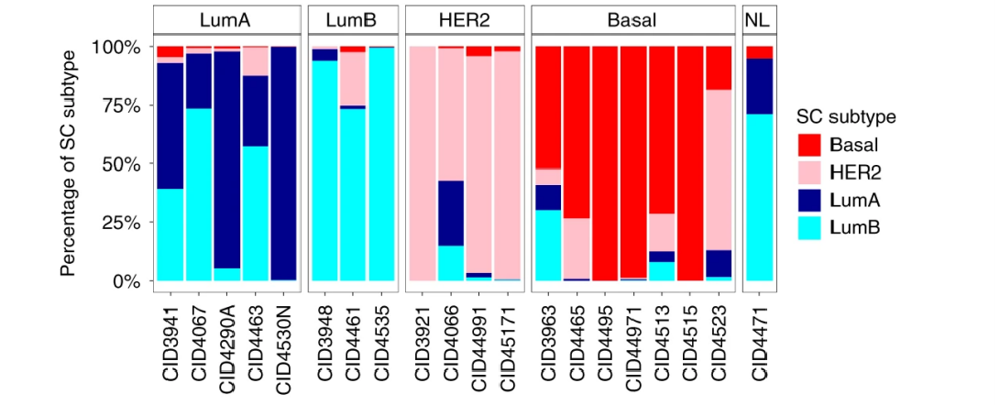

# Single-cell-transcriptomic-molecular-classification-of-breast-cancer

# Background
Three clinical subtypes of breast cancer: Luminal (ER+, PR+/−), HER2+(HER2+, ER+/−, PR+/−) and triple negative (TNBC; ER −, PR −, HER2 −)
Breast cancer PAM50 molecular subtypes: batch transcriptomic analysis of PAM50 gene markers classifies breast cancer into five "intrinsic" molecular subtypes: lumen like (LumA and LumB), HER2 rich, Basal like and Normal like
There is~70-80% consistency between molecular subtypes and clinical subtypes. Although PAM50 provides important insights for prognosis and treatment, due to the limitations of batch transcriptomics, it is not possible to determine the subtype of breast cancer specific tumor cells, so it is currently necessary to develop a single cell breast cancer molecular typing method.

# Obtain breast cancer tumor cells
After quality control of single cell samples, published gene markers were used to further confirm cell annotation, and all major cell types were representative in all tumors and clinical subtypes. Visualize epithelial cells clearly separated from tumors through UMAP. Since breast cancer is mainly driven by DNA copy number changes, InferCNV was used to estimate the single cell copy number variation (CNV) spectrum to distinguish tumor cells from normal epithelial cells. Select T cells and endothelial cells as reference genes (Figure 2, 4, 8, 10, 18), as these types of cells rarely exhibit copy number variation.

# Trianing set
In order to design and validate new subtype tools specific to scRNA Seq data, a robust training set sample is first determined, which not only relies on the PAM50 subtype of the Allcells Pseudobulk dataset for validation (as described above). Also, through the hierarchical clustering of Allcells Pseudobulk data and 1100 tumors in the TCGA breast cancer RNA Seq data set (containing~2000 genes with a breast cancer gene list), tumor samples with the same subtype were identified from these subtype clusters for evidence, and these samples with relatively accurate subtypes were used as training set samples. 

These training set samples were then paired with the test samples for single cell integration and differential gene expression calculations. Integration is done in pairs using the FindIntegrationAnchors and IntegrateData functions in the Seurat v3.0.0 software package, in an "intra group" manner. In short, the first step is to use mutual nearest neighbors to identify the anchor points between cell pairs in each dataset. The second step is to integrate the dataset together based on the distance based weight matrix constructed from anchor pairs. Subsequently, the Wilcoxon rank sum test using the FindAllMarkss function of the Seurat software package was used to calculate the differentially expressed genes between each pair.

# single cell subtype
For these differentially expressed genes, any duplicate genes that occurred between the four training groups were removed, resulting in four sets of genes that will define single cell derived molecular subtypes (89 genes Basal_SC; 102 genes HER2E_SC; 46 genes LumA_SC; 65 genes LumB_SC). Calculate the score of each subtype within each cell in a single cell sample to determine the cell subtype. Based on the proportion of each subtype within the sample, determine the sample subtype according to the maximum proportion result.

