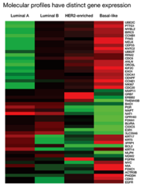

# Single-cell-transcriptomic-molecular-classification-of-breast-cancer

#Background
Three clinical subtypes of breast cancer: Luminal (ER+, PR+/−), HER2+(HER2+, ER+/−, PR+/−) and triple negative (TNBC; ER −, PR −, HER2 −)
Breast cancer PAM50 molecular subtypes: batch transcriptomic analysis of PAM50 gene markers classifies breast cancer into five "intrinsic" molecular subtypes: lumen like (LumA and LumB), HER2 rich, Basal like and Normal like
There is~70-80% consistency between molecular subtypes and clinical subtypes. Although PAM50 provides important insights for prognosis and treatment, due to the limitations of batch transcriptomics, it is not possible to determine the subtype of breast cancer specific tumor cells, so it is currently necessary to develop a single cell breast cancer molecular typing method.

